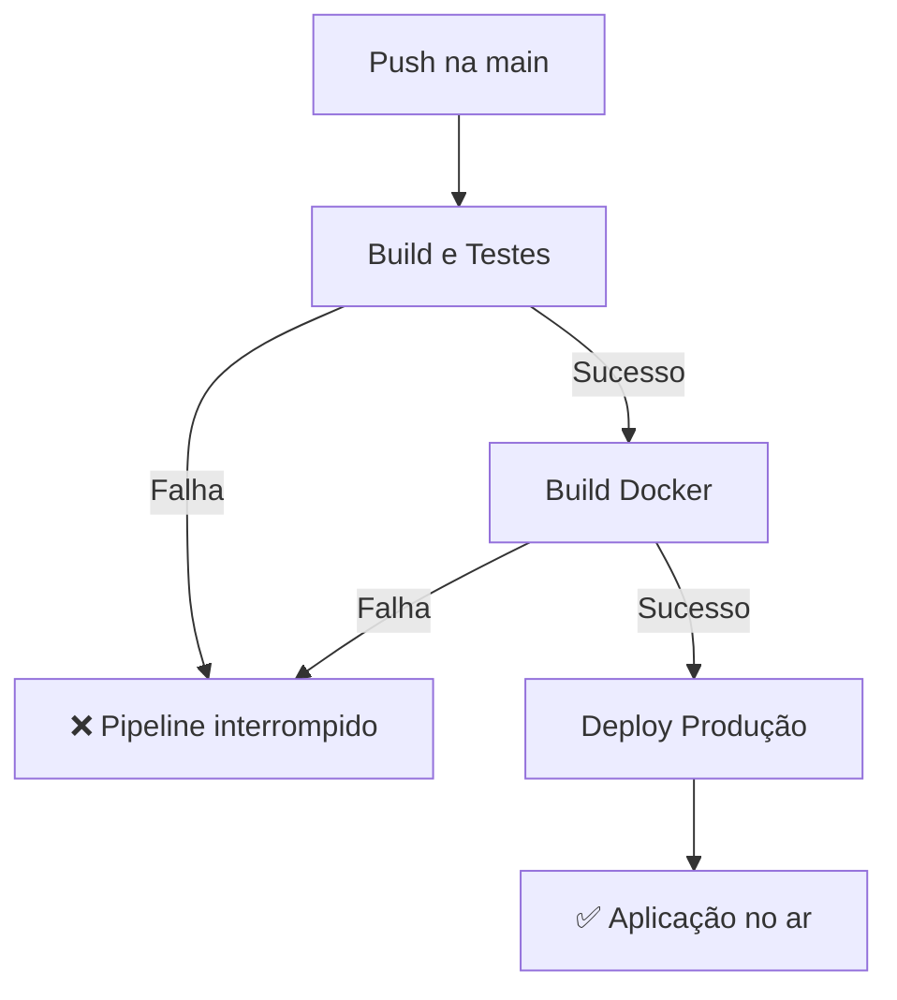

# 📋 Relatório de CI/CD - Delivery API

## 📌 Visão Geral

Este documento descreve o pipeline de CI/CD (Integração Contínua e Deploy Contínuo) implementado para a **Delivery API** usando GitHub Actions. O pipeline é acionado automaticamente a cada push na branch `main` e garante que o código seja testado, construído e implantado de forma automatizada e segura.

---

## 🎯 Objetivos do Pipeline

- ✅ **Garantir qualidade**: Executar testes automatizados antes de qualquer deploy
- 🐳 **Automatizar build**: Criar imagens Docker automaticamente
- 🚀 **Deploy seguro**: Implantar apenas código que passou em todos os testes
- 🔐 **Segurança**: Usar secrets do GitHub para credenciais sensíveis
- 📊 **Rastreabilidade**: Versionamento de imagens Docker por número de execução

---

## 🔄 Trigger do Pipeline

```yaml
on:
  push:
    branches: [ main ]
```

**O que faz:** O pipeline é executado automaticamente sempre que há um `push` (commit) na branch `main`.

**Por que é importante:** Garante que todas as alterações no código de produção sejam validadas e implantadas automaticamente.

---

## 🌍 Variáveis de Ambiente Globais

```yaml
env:
  SPRING_PROFILES_ACTIVE: prod
```

**O que faz:** Define o perfil Spring como `prod` para todas as etapas do pipeline.

**Por que é importante:** Garante que as configurações de produção sejam usadas durante o processo de build e deploy.

---

## 📦 Job 1: Build e Testes (`build_and_test`)

### 🎯 Objetivo
Compilar o código, executar todos os testes (unitários e de integração) e validar que a aplicação está funcionando corretamente.

### 🔧 Configuração

```yaml
runs-on: ubuntu-latest
environment: prod
```

- **runs-on**: Executa em uma máquina virtual Ubuntu (ambiente Linux)
- **environment**: Usa o environment "prod" para acessar secrets configuradas no GitHub

---

### 📝 Etapas Detalhadas

#### 1️⃣ Checkout do Código
```yaml
- name: 📦 Checkout do código
  uses: actions/checkout@v3
```

**O que faz:** Faz o download do código do repositório para a máquina virtual.

**Por que é necessário:** Sem essa etapa, não teríamos acesso ao código para compilar e testar.

---

#### 2️⃣ Configurar JDK 21
```yaml
- name: ☕ Configurar JDK 21
  uses: actions/setup-java@v3
  with:
    java-version: '21'
    distribution: 'temurin'
```

**O que faz:** Instala o Java Development Kit (JDK) versão 21 na máquina virtual.

**Detalhes técnicos:**
- **java-version**: Versão específica do Java necessária para o projeto
- **distribution**: Usa a distribuição Temurin (Eclipse Adoptium), que é open-source e confiável

**Por que JDK 21:** A aplicação foi desenvolvida usando recursos do Java 21.

---

#### 3️⃣ Cache do Maven
```yaml
- name: 🔧 Cache do Maven
  uses: actions/cache@v3
  with:
    path: ~/.m2/repository
    key: ${{ runner.os }}-maven-${{ hashFiles('**/pom.xml') }}
    restore-keys: |
      ${{ runner.os }}-maven-
```

**O que faz:** Armazena em cache as dependências do Maven para acelerar execuções futuras.

**Como funciona:**
- **path**: Diretório onde o Maven armazena as dependências baixadas
- **key**: Chave única baseada no SO e no hash do `pom.xml`
- **restore-keys**: Chave de fallback caso o cache exato não seja encontrado

**Benefícios:**
- ⚡ Reduz o tempo de build em 50-80%
- 💰 Economiza largura de banda
- 🔄 Cache é invalidado automaticamente quando o `pom.xml` muda

---

#### 4️⃣ Compilar e Rodar Testes
```yaml
- name: 🧩 Compilar e rodar testes
  run: mvn clean verify -Dspring.profiles.active=test
```

**O que faz:** Executa o comando Maven que:
1. **clean**: Remove arquivos de builds anteriores
2. **verify**: Compila o código, roda todos os testes (unitários e de integração) e valida o pacote

**Detalhes técnicos:**
- `-Dspring.profiles.active=test`: Força o uso do perfil de teste
- Se qualquer teste falhar, o pipeline é interrompido ❌

**Testes executados:**
- ✅ Testes unitários (JUnit)
- ✅ Testes de integração (com Testcontainers ou embedded databases)
- ✅ Validações de código

---

#### 5️⃣ Upload de Relatórios de Teste
```yaml
- name: Upload Test Reports
  if: always()
  uses: actions/upload-artifact@v4
  with:
    name: test-reports
    path: |
      target/surefire-reports/
      target/failsafe-reports/
```

**O que faz:** Faz upload dos relatórios de teste para o GitHub Actions.

**Detalhes técnicos:**
- **if: always()**: Executa mesmo se os testes falharem
- **surefire-reports**: Relatórios de testes unitários
- **failsafe-reports**: Relatórios de testes de integração

**Benefícios:**
- 📊 Permite visualizar resultados detalhados dos testes
- 🐛 Facilita debug de falhas
- 📈 Mantém histórico de execução de testes

---

#### 6️⃣ Verificar Resultados
```yaml
- name: ✅ Verificar resultados dos testes
  if: success()
  run: echo "✅ Testes concluídos com sucesso!"
```

**O que faz:** Exibe mensagem de sucesso apenas se todos os testes passarem.

**if: success()**: Só executa se todas as etapas anteriores foram bem-sucedidas.

---

## 🐳 Job 2: Build da Imagem Docker (`docker_build`)

### 🎯 Objetivo
Criar uma imagem Docker da aplicação e enviá-la para o Docker Hub para uso em produção.

### 🔗 Dependência

```yaml
needs: build_and_test
```

**O que faz:** Este job só executa se o `build_and_test` for bem-sucedido.

**Por que é importante:** Garante que apenas código testado seja transformado em imagem Docker.

---

### 📝 Etapas Detalhadas

#### 1️⃣ Checkout do Código
```yaml
- name: 📦 Checkout do código
  uses: actions/checkout@v3
```

**O que faz:** Faz download do código novamente (cada job roda em uma VM isolada).

---

#### 2️⃣ Configurar Docker Buildx
```yaml
- name: 🧰 Configurar Docker Buildx
  uses: docker/setup-buildx-action@v2
```

**O que faz:** Configura o Docker Buildx, uma ferramenta avançada de build do Docker.

**Recursos do Buildx:**
- 🚀 Builds mais rápidos com cache
- 🏗️ Suporte a multi-plataforma (AMD64, ARM64)
- 📦 Build de múltiplas imagens simultaneamente

---

#### 3️⃣ Login no Docker Hub
```yaml
- name: 🔐 Login no Docker Hub
  uses: docker/login-action@v3
  with:
    username: ${{ secrets.DOCKER_USERNAME }}
    password: ${{ secrets.DOCKER_PASSWORD }}
```

**O que faz:** Autentica no Docker Hub usando credenciais armazenadas como secrets do GitHub.

**Segurança:**
- 🔐 Credenciais nunca aparecem nos logs
- 🛡️ Secrets são criptografadas no GitHub
- ✅ Acesso controlado por environments

**Como configurar secrets:**
1. Vá em: `Settings` → `Secrets and variables` → `Actions`
2. Clique em `New repository secret`
3. Adicione:
   - `DOCKER_USERNAME`: seu usuário do Docker Hub
   - `DOCKER_PASSWORD`: sua senha ou token de acesso

---

#### 4️⃣ Build e Push da Imagem
```yaml
- name: 🏗️ Build e Push da imagem
  uses: docker/build-push-action@v5
  with:
    push: true
    tags: |
      ${{ secrets.DOCKER_USERNAME }}/delivery-api:latest
      ${{ secrets.DOCKER_USERNAME }}/delivery-api:${{ github.run_number }}
```

**O que faz:** Constrói a imagem Docker e envia para o Docker Hub com duas tags.

**Tags criadas:**
1. **latest**: Sempre aponta para a versão mais recente
2. **run_number**: Tag única com o número da execução (ex: `delivery-api:42`)

**Vantagens do versionamento:**
- 🔄 Facilita rollback para versões anteriores
- 📊 Rastreabilidade de deploys
- 🐛 Debug de problemas específicos de versão

**Exemplo de tags criadas:**
```
felipeuser/delivery-api:latest
felipeuser/delivery-api:123
```

---

## 🚀 Job 3: Deploy de Produção (`deploy`)

### 🎯 Objetivo
Implantar a nova versão da aplicação no servidor de produção.

### 🔗 Dependências

```yaml
needs: docker_build
environment:
  name: prod
  url: https://meu-servidor-deploy.com
```

**O que faz:** 
- Só executa se o `docker_build` for bem-sucedido
- Usa o environment "prod" com proteções adicionais
- Define URL do ambiente (opcional, mas útil para visualização)

**Proteções do environment:**
- 👥 Pode exigir aprovação manual de revisores
- ⏰ Pode ter delay configurável
- 🔐 Acesso restrito a secrets específicas

---

### 📝 Etapas Detalhadas

#### 1️⃣ Deploy Automático
```yaml
- name: 📡 Deploy automático
  run: |
    echo "Iniciando deploy..."
    # Exemplo de deploy remoto via SSH:
    # ssh ${{ secrets.SERVER_USER }}@${{ secrets.SERVER_HOST }} \
    #   "docker pull ${{ secrets.DOCKER_USERNAME }}/delivery-api:latest && docker compose up -d"
    echo "✅ Deploy finalizado com sucesso!"
```

**Status atual:** Configurado como exemplo (comentado).

**Como funciona um deploy real:**

```bash
# 1. Conecta no servidor via SSH
ssh usuario@servidor.com

# 2. Faz pull da nova imagem
docker pull felipeuser/delivery-api:latest

# 3. Reinicia os containers
docker compose up -d
```

**Secrets necessárias para deploy real:**
- `SERVER_USER`: Usuário SSH do servidor
- `SERVER_HOST`: IP ou domínio do servidor
- `SSH_PRIVATE_KEY`: Chave privada SSH para autenticação

---

### 🔄 Estratégias de Deploy

#### Opção 1: Deploy via SSH (Recomendado)
```yaml
- name: 📡 Deploy via SSH
  uses: appleboy/ssh-action@master
  with:
    host: ${{ secrets.SERVER_HOST }}
    username: ${{ secrets.SERVER_USER }}
    key: ${{ secrets.SSH_PRIVATE_KEY }}
    script: |
      cd /caminho/da/aplicacao
      docker pull ${{ secrets.DOCKER_USERNAME }}/delivery-api:latest
      docker compose down
      docker compose up -d
      docker image prune -f
```

#### Opção 2: Deploy via Webhook
```yaml
- name: 📡 Trigger deploy webhook
  run: |
    curl -X POST ${{ secrets.DEPLOY_WEBHOOK_URL }} \
      -H "Authorization: Bearer ${{ secrets.WEBHOOK_TOKEN }}" \
      -d '{"version": "${{ github.run_number }}"}'
```

#### Opção 3: Deploy em Cloud (AWS/Azure/GCP)
```yaml
- name: 📡 Deploy no ECS (AWS)
  uses: aws-actions/amazon-ecs-deploy-task-definition@v1
  with:
    task-definition: task-definition.json
    service: delivery-api-service
    cluster: production-cluster
```

---

## 📊 Fluxo Completo do Pipeline



### Tempo estimado de execução:
- **Build e Testes**: ~3-5 minutos
- **Build Docker**: ~2-3 minutos
- **Deploy**: ~1-2 minutos
- **Total**: ~6-10 minutos

---

## 🔐 Configuração de Secrets

### Secrets necessárias:

| Secret | Descrição | Onde obter |
|--------|-----------|------------|
| `DOCKER_USERNAME` | Usuário do Docker Hub | [hub.docker.com](https://hub.docker.com) |
| `DOCKER_PASSWORD` | Senha ou token do Docker Hub | Docker Hub → Account Settings → Security |
| `SERVER_HOST` | IP/domínio do servidor | Seu provedor de hospedagem |
| `SERVER_USER` | Usuário SSH | Configuração do servidor |
| `SSH_PRIVATE_KEY` | Chave SSH privada | `cat ~/.ssh/id_rsa` |

### Como adicionar secrets:
1. Vá em: `Repositório` → `Settings` → `Secrets and variables` → `Actions`
2. Clique em `New repository secret`
3. Adicione cada secret com seu respectivo valor
4. Clique em `Add secret`

---

## 🛡️ Boas Práticas Implementadas

### ✅ Segurança
- 🔐 Uso de secrets para credenciais sensíveis
- 🛡️ Environments com proteções configuráveis
- 🔑 Autenticação via SSH keys ou tokens

### ✅ Qualidade
- 🧪 Testes obrigatórios antes de qualquer deploy
- 📊 Relatórios de teste sempre disponíveis
- ❌ Pipeline interrompido em caso de falha

### ✅ Performance
- ⚡ Cache de dependências Maven
- 🚀 Docker Buildx para builds otimizados
- 📦 Imagens Docker com multi-stage builds

### ✅ Rastreabilidade
- 🏷️ Versionamento de imagens por run number
- 📝 Logs detalhados de cada etapa
- 🔄 Histórico completo no GitHub Actions

---

## 🐛 Troubleshooting

### Problema: Testes falhando no CI mas passam localmente

**Possíveis causas:**
- Diferenças de ambiente (banco de dados, Redis)
- Testcontainers não está configurado corretamente
- Dependências não estão no cache

**Solução:**
```yaml
# Adicione service containers se necessário
services:
  postgres:
    image: postgres:16-alpine
    env:
      POSTGRES_PASSWORD: postgres
    options: >-
      --health-cmd pg_isready
      --health-interval 10s
      --health-timeout 5s
      --health-retries 5
```

---

### Problema: Build Docker falha

**Possíveis causas:**
- Dockerfile não encontrado
- Dependências não resolvidas
- Falta de memória

**Solução:**
```yaml
# Aumente recursos da VM
runs-on: ubuntu-latest
env:
  MAVEN_OPTS: "-Xmx2048m"
```

---

### Problema: Deploy falha

**Possíveis causas:**
- Credenciais SSH incorretas
- Servidor indisponível
- Portas bloqueadas

**Solução:**
- Verifique as secrets configuradas
- Teste conexão SSH manualmente
- Verifique firewall do servidor

---

## 📈 Melhorias Futuras

### 🎯 Curto Prazo
- [ ] Adicionar testes de cobertura de código (JaCoCo)
- [ ] Implementar análise de segurança (Snyk, Trivy)
- [ ] Configurar notificações (Slack, Discord, Email)

### 🎯 Médio Prazo
- [ ] Implementar deploy blue-green
- [ ] Adicionar health checks pós-deploy
- [ ] Criar ambientes de staging e preview

### 🎯 Longo Prazo
- [ ] Implementar rollback automático
- [ ] Integrar monitoramento (Prometheus, Grafana)
- [ ] Adicionar testes de performance automatizados

---

## 📚 Referências

- [GitHub Actions Documentation](https://docs.github.com/en/actions)
- [Docker Build Push Action](https://github.com/docker/build-push-action)
- [Maven Verify Lifecycle](https://maven.apache.org/guides/introduction/introduction-to-the-lifecycle.html)
- [Spring Boot CI/CD Best Practices](https://spring.io/guides/gs/spring-boot-docker/)

---

## 👥 Equipe Responsável

- **DevOps**: Configuração e manutenção do pipeline
- **Desenvolvedores**: Garantir que testes passem antes de push
- **QA**: Validação de testes e qualidade do código

---

## 📝 Conclusão

Este pipeline de CI/CD garante que:

✅ Todo código é testado automaticamente  
✅ Apenas código validado chega à produção  
✅ Deploys são rápidos e confiáveis  
✅ Rastreabilidade completa de versões  
✅ Rollback facilitado em caso de problemas  

**Resultado:** Entregas mais rápidas e seguras, com menos erros em produção.